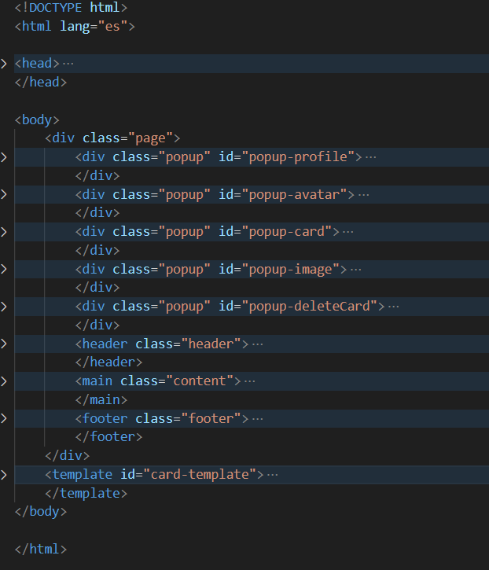
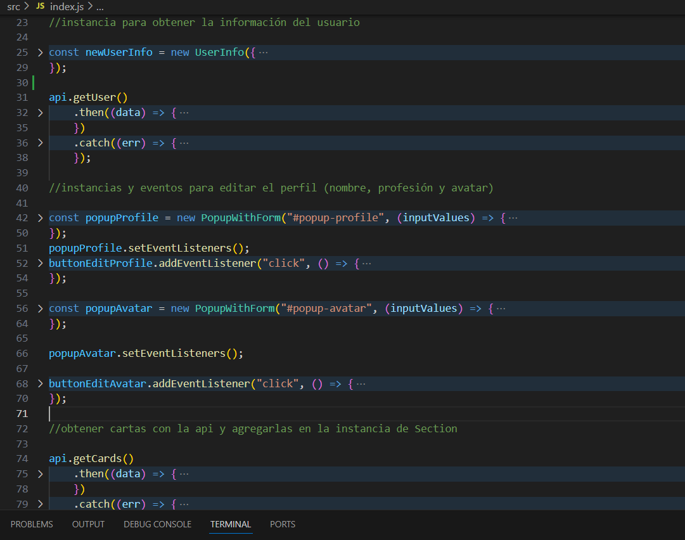

# Tripleten web_project_around

DESCRIPCIÓN:
Alrededor del mundo, página para agregar tarjetas con fotos de cualquier parte del mundo y su nombre correspondiente, se puede eliminar o darle like a tus tarjetas o las de otros usuarios. Ademas cada usuario puede modificar el perfil con sus datos (nombre, profesión y avatar).

HERRAMIENTAS utilizadas en todo el proyecto:

-HTML: documento principal

-CSS: para dar estilo a la pagina en general, a los popups y tarjetas
-JAVASCRIPT: funcionalidad para crear cartas, eliminarlas, boton de like/dislike, abrir/cerrar ventanas modales, modificar perfil, etc.

-WEBPACK: empaquetador de módulos que me ayudó a gestionar y optimizar los recursos de mi proyecto (JavaScript, CSS, imágenes, etc.). Su objetivo es transformar y agrupar los archivos y dependencias en un solo archivo (o pocos archivos) para mejorar el rendimiento en producción.

-NPM: administrador de paquetes para Node.js. Se usa para instalar y gestionar las bibliotecas y dependencias del proyecto. Con NPM, pude definir los scripts necesarios en el archivo package.json para automatizar tareas, como ejecutar Webpack, iniciar un servidor de desarrollo u otros.

INSTALACIÓN:

1. clona el proyecto:
   git clone git@github.com:LuisaMSegur/web_project_around.git
2. Entra en la carpeta del repositorio:
   cd web_project_around
3. instala las dependencias:
   npm install

Scripts Disponibles:
-npm run dev: Inicia el servidor en modo desarrollo.
-npm run build: Compila el proyecto para producción.

link de la pagina en Github (en la rama main):

https://luisamsegur.github.io/web_project_around/
